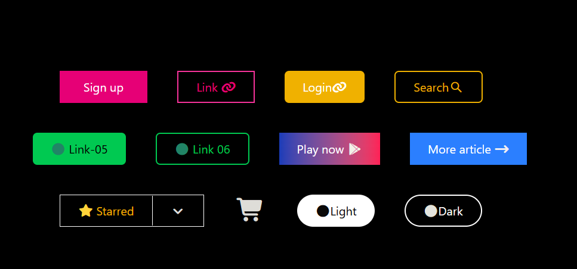

This project demonstrates multiple button styles including solid buttons, outline buttons, gradient buttons, icon buttons, split dropdown buttons, and theme-style rounded buttons — all arranged in a responsive flex layout.

---

## 📌 Project Description

This project is designed to practice and demonstrate:

* Utility-first CSS styling using Tailwind
* Flexbox layout and alignment
* Button hover interactions
* Icon integration with Font Awesome
* Responsive wrapping using `flex-wrap`
* Clean UI structuring on a dark theme background

The interface displays a centered container on a full-screen black background containing multiple styled buttons.

---

## 🛠️ Technologies Used

| Technology         | Purpose                  |
| ------------------ | ------------------------ |
| HTML5              | Structure of the webpage |
| Tailwind CSS (CDN) | Utility-based styling    |
| Font Awesome 7     | Icons for buttons        |

CDN Links Used:

* Tailwind Browser CDN
* Font Awesome 7 CDN

PREVIEW



---

## 🧱 Layout Structure

### 🌑 Background

* `bg-black`
* `min-h-screen`
* Centered using `flex`, `justify-center`, and `items-center`

### 📦 Main Container

* Width: `w-1/2`
* Padding: `p-10`
* Flex layout with `gap-10`
* `flex-wrap` enabled for responsiveness

---

## 🎯 UI Components Breakdown

### 1️⃣ Solid Buttons

* **Sign Up** → Pink background, hover turns yellow
* **Login** → Yellow background with rounded corners
* **Link-05** → Green background, hover turns red

### 2️⃣ Outline Buttons

* Pink outline button
* Yellow outline button
* Green outline button
* Dark theme rounded outline button

### 3️⃣ Gradient Button

* Blue to Rose gradient (`bg-gradient-to-r from-blue-800 to-rose-500`)
* Includes Google Play icon

### 4️⃣ Icon Buttons

* Shopping cart icon button
* Arrow icon button (More article)
* Circle icons inside buttons
* Search and Link icons

### 5️⃣ Split Dropdown Button

* Starred button section
* Divider with dropdown arrow
* Styled using flex and border utilities

### 6️⃣ Theme Buttons

* Light button (rounded full, white background)
* Dark button (rounded full, outlined white)

---

## 🔄 Hover Effects

Each button includes hover interactions such as:

* Background color change
* Border color change
* Smooth visual transitions (via Tailwind hover utilities)

---

## 📱 Responsiveness

* Uses `flex-wrap` to automatically move buttons to the next line.
* Layout remains centered across different screen sizes.
* Works on desktop and mobile screens.

---

## 📂 Project Structure

```
project-folder/
│
├── index.html
└── README.md
```

---

## ▶️ How to Run the Project

### Option 1: Open Directly

1. Download the project folder.
2. Open `index.html` in your browser.

### Option 2: Using VS Code (Recommended)

1. Open folder in VS Code.
2. Install Live Server extension.
3. Right-click `index.html`.
4. Click **Open with Live Server**.

---

## 🎓 What You Learn From This Project

* Tailwind utility class usage
* Flexbox layout system
* Hover effects and button styling
* Icon integration
* UI component structuring
* Clean spacing and alignment


